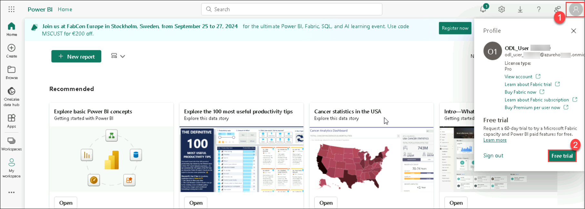
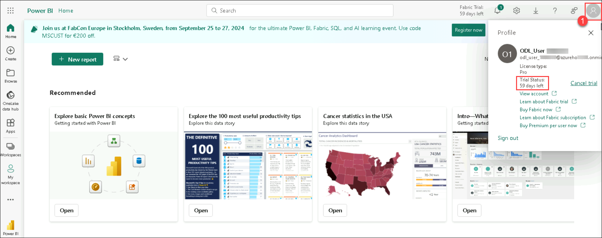

### Exercise 1: Create a Fabric workspace

In this exercise, you build a lakehouse, ingest sample data into the delta table, apply transformation where required, and then create reports.

#### Task 1.1: Assign Fabric Administrator Role

1. Start by searching for **Microsoft Entra ID** in the search pane in the Azure portal.

   

2. Navigate to **Roles and administrators**.

   

3. In the **Roles and administrators** page, search for **Fabric Administrator (1)**, and click on **Fabric Administrator (2)**.

   

4. This will take you to the **Fabric Administrator | Assignments** page where you will have to assign yourself the **Fabric Administrator role**. Now, click on **+ Add assignments (1)**.

    

5. Make sure to **check the box (1)** next to your username, confirm if it is **Selected (2)** and click on **Add (3)**.

    

6. You can confirm the **Fabric Administrator** role has been added successfully by **refreshing (1)** Fabric Administrators | Assignments page. After **confirming (2)** it has been added successfully, navigate back to **Home (3)**.

    

----

#### Task 1.2: Sign up for the Microsoft Fabric Trial

1. Copy the **Power BI homepage link**, and open this link inside the VM in a new tab.

   ```
   https://powerbi.com
   ```

2. Select **Account manager (1)**, and click on **Free trial (2)**.

     

3. A new prompt will appear asking you to **Upgrade to a free Microsoft Fabric trial**, click on **Start trial (1)**.

    

4. Once your trial capacity is ready, you receive a confirmation message. Select **Stay on current page** to begin working in Fabric.

    

6. Now, open **Account manager (1)** again, and verify **Trial status (2)**.

   

----

#### Task 1.3: Create a workspace

Here, you create a Fabric workspace. The workspace contains all the items needed for this lakehouse tutorial, which includes lakehouse, dataflows, Data Factory pipelines, notebooks, Power BI datasets, and reports.

1. Now, select **Workspaces** and click on **+ New workspace**.

    

2. Fill out the **Create a workspace** form with the following details:

   - **Name:** Enter **Fabric Lakehouse Tutorial**, and any extra characters to make the name unique.
   - **Description:** Enter **Lakehouse Demo**

    

3. Select Advanced, expand it, and Under **License mode**, select **Trial capacity (1)** and click on **Apply (2)** to create and open the workspace.

    

Congratulations! You have successfully learned to create a Fabric workspace.

----

*Continue to page 9 ...*
